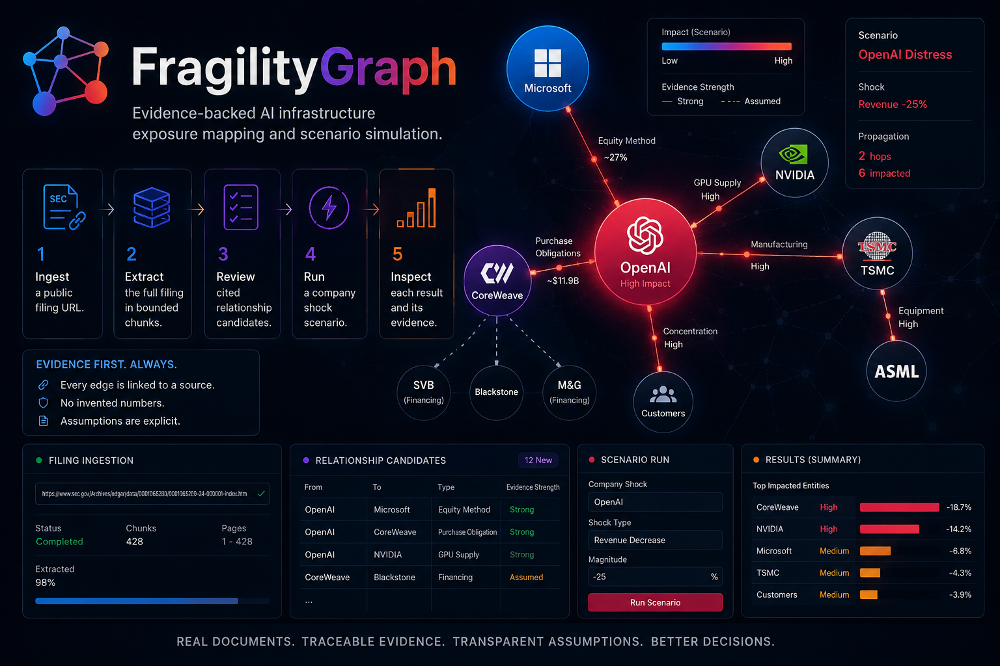

# FragilityGraph

> Evidence-backed AI-infrastructure exposure mapping and scenario simulation.

[](LICENSE)
[](https://www.python.org/)
[](https://nextjs.org/)
[](CONTRIBUTING.md)

<p align="center">
  
</p>

FragilityGraph reads real SEC filings, turns **supported, cited** claims into
reviewable graph edges, and simulates how a shock to one company propagates
through the AI economy — **without ever inventing a number**. Every figure in the
graph traces back to an exact passage in a source document, and no relationship
enters a scenario until a human has approved it.

## Why

Large language models are happy to fabricate a plausible-looking financial
figure. That makes them dangerous for exposure analysis, where a made-up number
looks exactly like a disclosed one. FragilityGraph is built around the opposite
discipline:

> **The model proposes, code verifies, a human approves.** Only approved,
> evidence-backed relationships drive a scenario. When a filing doesn't disclose
> how a shock propagates, the engine says *unknown* instead of guessing.

## Features

- **Ingest by URL** — paste a public SEC filing URL; the full document is read in
  bounded, overlapping chunks (no whole-document character cutoff).
- **Cited extraction** — supported claims become typed candidate edges, each
  carrying the verbatim passage it was drawn from.
- **Review before trust** — candidates are verified mechanically, then wait for
  human approval before they can influence any scenario.
- **Shock scenarios** — model a loss at any company and watch the impact spread;
  results separate *forced accounting loss*, *exposure at risk*, and *unresolved*.
- **Detonation view** — propagation animates outward from the shock origin, and
  each node lights in its result colour, turning the graph into a contagion map.
- **Copilot** — a chat assistant that ingests filings, answers questions about a
  filing's content **with citations**, and can create and run scenarios.
- **Evidence desk** — inspect any relationship, result, or source, with grouped
  edges that never lose their individual evidence records.

## How it works

1. **Ingest** a public filing URL.
2. **Extract** the full filing in bounded chunks into cited candidate edges.
3. **Review** the candidates and approve the ones backed by real evidence.
4. **Simulate** a company shock over the approved graph.
5. **Inspect** each result and its supporting passage or declared assumption.

## Core principle: evidence over invention

A scenario classifies every affected relationship into one of three honest
outcomes:

| Outcome | Meaning | Colour |
| --- | --- | --- |
| **Impact** | A forced accounting loss (e.g. equity-method share of a disclosed net loss). | Red |
| **Exposure** | An amount placed *at risk* — **not** a realized loss (realizing it needs PD/LGD/EAD that no filing discloses). | Orange |
| **Unresolved** | A documented relationship with no disclosed propagation mechanism — the engine refuses to invent a number. | Amber (dashed) |

## Architecture

Two local services:

- **Frontend** — a Next.js app in [`revamp/frontend`](revamp/frontend), served at
  http://localhost:3000.
- **Backend** — a FastAPI app in [`revamp/backend`](revamp/backend), served at
  http://localhost:8000 with Swagger docs at http://localhost:8000/docs.

The frontend calls the backend through `NEXT_PUBLIC_API_BASE`. The backend stores
data in SQLite by default (or hosted PostgreSQL) and can use either a
deterministic offline fallback or OpenAI for extraction and the copilot.

**Stack:** FastAPI · SQLAlchemy 2 · Pydantic v2 · PyMuPDF · OpenAI SDK ·
Next.js · React · [@xyflow/react](https://reactflow.dev/) · Tailwind CSS ·
TypeScript.

## Getting started

### Prerequisites

- Python 3.11 or later
- Node.js 20 or later, with npm
- [`uv`](https://docs.astral.sh/uv/) (recommended for the backend; a
  `venv`/`pip` fallback is shown below)

Open two terminals at the repository root.

### 1. Backend

```bash
cd revamp/backend
cp .env.example .env
```

For a reliable first run without credentials, set `LLM_PROVIDER=fallback` in
`.env`. Then:

```bash
uv sync --dev
uv run uvicorn app.main:app --reload
```

Health check: http://localhost:8000/health · API docs: http://localhost:8000/docs

<details>
<summary>No <code>uv</code>? Use a standard virtualenv</summary>

```bash
cd revamp/backend
python3 -m venv .venv
source .venv/bin/activate
pip install \
  "fastapi>=0.115" "uvicorn>=0.32" "sqlalchemy>=2.0" \
  "pydantic>=2.9" "pydantic-settings>=2.6" "pymupdf>=1.24" \
  "rapidfuzz>=3.10" "openai>=1.54" "pytest>=8.3" "httpx>=0.27"
uvicorn app.main:app --reload
```

The reported `python3` version must be 3.11 or later.
</details>

### 2. Frontend

In a second terminal from the repository root:

```bash
cd revamp/frontend
cp .env.local.example .env.local
npm install
npm run dev
```

Open http://localhost:3000. The example config points to http://localhost:8000;
change `NEXT_PUBLIC_API_BASE` in `.env.local` only if the backend runs elsewhere.

### Sample data

A fresh, empty database is seeded automatically with a verified hero graph —
filings and passages, approved relationships, and a scenario modeling a shock to
OpenAI — so there is nothing to download. Existing non-empty databases are
preserved. To recreate the sample alongside a populated database, point
`DATABASE_URL` at a new SQLite path such as `sqlite:///./fragilitygraph-demo.db`.

## Configuration

Choose a provider in `revamp/backend/.env`:

- **Offline** — `LLM_PROVIDER=fallback`: a deterministic proposer that needs no
  credentials, suitable for local exploration and demos.
- **OpenAI** — `LLM_PROVIDER=openai`, plus `OPENAI_API_KEY` and an
  `OPENAI_MODEL` that supports structured outputs. Enables OpenAI-backed
  extraction and copilot responses.

`.env` and `.env.local` are git-ignored — never commit credentials.

## Development

Run the backend tests:

```bash
cd revamp/backend
uv run pytest        # or: source .venv/bin/activate && pytest
```

Run the frontend checks:

```bash
cd revamp/frontend
npm test
npm run lint
npm run build
```

See [CONTRIBUTING.md](CONTRIBUTING.md) for the full contribution workflow.

## Deployment

Deploy the demo with Neon, Render, and Vercel. Keep all connection strings, API
keys, and deployment origins in the provider dashboards — never in the repo.

1. In **Neon**, create a project and copy its pooled PostgreSQL connection string.
2. In **Render**, create a Blueprint from this repo's [`render.yaml`](render.yaml).
   Confirm it creates the `fragilitygraph-api` web service from `main`, then set
   `DATABASE_URL` to the Neon string. The Blueprint defaults to
   `LLM_PROVIDER=fallback`; if you switch to `openai`, also set `OPENAI_API_KEY`.
3. Wait for the Render `/health` endpoint to succeed, then confirm `/entities`
   and `/scenarios` return the hero data.
4. In **Vercel**, import this repo and set the Root Directory to
   `revamp/frontend` (framework: Next.js).
5. Set `NEXT_PUBLIC_API_BASE` to the public Render origin (no trailing slash) and
   deploy the frontend.
6. Copy the final Vercel origin and set `FRONTEND_ORIGIN` on the Render service to
   it (no trailing slash), then redeploy Render.
7. Open the Vercel app, run the hero scenario, reload, and confirm the graph
   persists — proving the data lives in Neon.

Neon and Render free tiers wake from idle, so the first request after idle can be
slow.

## Troubleshooting

- **Port already in use** — stop whatever holds port 8000/3000, or run on another
  port and update `NEXT_PUBLIC_API_BASE`.
- **Frontend can't reach the API** — confirm the backend answers at
  http://localhost:8000/health and that `.env.local` uses the same URL; restart
  `npm run dev` after changing it.
- **OpenAI requests fail** — use `LLM_PROVIDER=fallback`, or confirm
  `OPENAI_API_KEY` and `OPENAI_MODEL` are set in `revamp/backend/.env`.

## Limitations

- Extraction quality depends on the source text and the selected LLM provider.
- Candidate relationships require human review before entering the trusted graph.
- Scenario outputs propagate declared evidence and assumptions — they are **not
  investment advice or price forecasts**.
- The fallback provider is deterministic for demos and not a substitute for
  model-backed extraction.

## Contributing

Contributions are welcome. Please read [CONTRIBUTING.md](CONTRIBUTING.md) first —
in particular the **evidence-first principle**: new features must never introduce
fabricated or un-cited figures into the graph.

## How GPT is used

GPT plays two distinct roles in this project.

### In the product (runtime)

OpenAI GPT models power the app's live intelligence when `LLM_PROVIDER=openai`:

- **Filing extraction (ingest)** — GPT reads each filing chunk and proposes typed,
  cited relationship candidates, using structured outputs so every claim carries
  the verbatim passage it came from.
- **Chat copilot** — GPT drives the assistant that ingests filings, answers
  questions about a filing's content **with citations**, and creates and runs
  scenarios through tool calls.

Crucially, GPT only ever *proposes*. Its output is mechanically verified against
the source text and must be human-approved before it can influence a scenario —
so the model never inserts an un-cited or invented number into the graph. (A
deterministic `fallback` provider is available for offline use with no key.)

### At build time (development)

GPT-5.6 and Codex were iterative engineering collaborators, not autonomous
authors. They accelerated codebase exploration, the move from a
40,000-character ingestion cutoff to bounded full-document chunking, UX work
(evidence desk, grouped relationships, scenario cards, propagation animation),
regression tests and browser-driven diagnosis, deployment hardening for Neon,
Render, and Vercel, and repeated lint/test/build verification loops.

Every generated change was read and tested before being accepted. The decisions
that define the product stayed human: the evidence-first boundary and the
refusal to invent missing financial values, the financial-terminal visual
direction, the review-before-trust workflow, and the project's scope.

## License

Released under the [MIT License](LICENSE). Copyright (c) 2026 Dawn.
